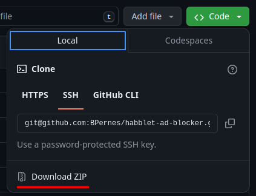
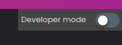
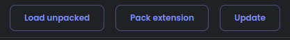
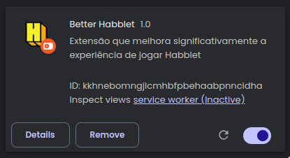
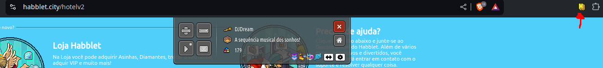
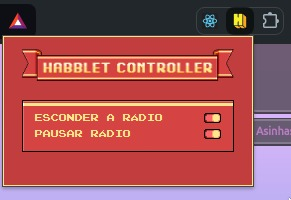
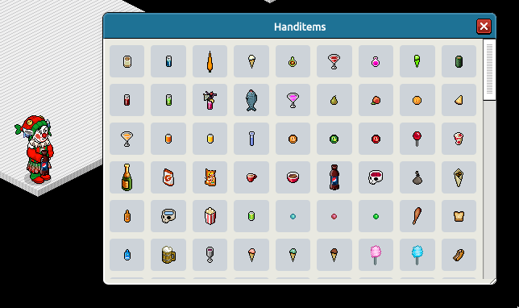

# Better Habblet

Better Habblet é uma extensão para navegadores baseados no Chromium projetada para aprimorar a experiência de jogar Habblet. Ela remove anúncios, oferece um controle mais fácil da rádio do jogo e adiciona menus utilitários dentro do ambiente virtual.

## Funcionalidades

- **Bloqueio de anúncios**: Remove permanentemente os banners de anúncios indesejados do jogo.
- **Controle da rádio**: Permite esconder ou silenciar a rádio do jogo de forma opcional, com sua escolha sendo mantida mesmo após fechar o navegador.
- **Menu de handitems**: Adiciona um menu interativo para seleção de handitems ao entrar em quartos do jogo.

## Instalação da Extensão

1. **Baixe o repositório zipado**:
   - Acesse o botão de download do repositório e clique para salvar o arquivo.
   
   

2. **Extraia os arquivos**:
   - Salve o arquivo zipado em um diretório de sua preferência e extraia o conteúdo.

3. **Acesse o gerenciador de extensões do navegador**:
   - Abra o navegador baseado em Chromium de sua preferência e navegue até a aba "Gerenciar Extensões".

4. **Habilite o modo desenvolvedor**:
   - Ative o modo desenvolvedor clicando no botão correspondente.
   
   

5. **Carregue a extensão**:
   - Clique em "Load unpacked" e selecione a pasta extraída do arquivo zip.
   
   

6. **Confirmação da instalação**:
   - A extensão será carregada corretamente e aparecerá junto com outras extensões instaladas.
   
   

7. **Fixe a extensão para acesso rápido**:
   - Pine a extensão na barra de ferramentas do navegador.

## Como Usar

1. **Bloqueio automático de anúncios**:
   - Ao acessar o jogo, os anúncios serão bloqueados automaticamente.

2. **Acessando o painel de opções**:
   - Certifique-se de estar na URL do jogo (`habblet.city/hotelv2`) e clique no ícone da extensão para abrir o painel de opções.
   
   

3. **Configurações personalizadas**:
   - Escolha entre as opções disponíveis (as configurações permanecem após recarregar a página).
   
   

4. **Menu de handitems**:
   - Ao entrar em um quarto, um menu de handitems será adicionado à barra de ferramentas.
   
   

5. **Selecione um handitem**:
   - Clique no ícone do menu para abrir a lista de handitems. Escolha um item, e ele será equipado automaticamente, sem necessidade de comandos como `:handitem x`.
   
   

## Futuras Melhorias

- **Menu utilitário de enables**: Inclusão de uma ferramenta para gerenciar enables do jogo.
- **Compatibilidade ampliada**: Permitir o uso da extensão em navegadores não baseados no Chromium, como Firefox.
- ~~**Integração de ferramenta de build**: Implementar suporte a sistemas como Esbuild, Vite ou Webpack para facilitar o desenvolvimento e distribuição.~~

---

Aproveite sua experiência no Habblet com a Better Habblet!
